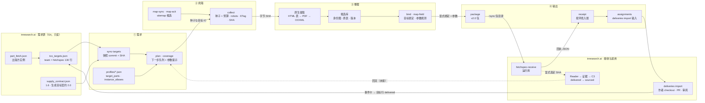
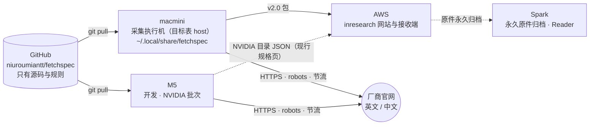

# Fetchspec 架构（2026-09-30）

一条主线：**需求 → 爬取 → 整理 → 输出**。左边是 inresearch 的需求源，右边是 inresearch 的接收与采用，目标行状态回写 inresearch 的 Git 后成为下一轮需求。为什么这样分、每段的边界是什么，见 [框架](framework-2026-09-30.md)。

图的约定与 infra 相同：实线是已经实现的路径，虚线是未接通或需要人工的路径。SVG 跟随系统明暗主题；下面的 Mermaid 版是同一份事实，方便在 GitHub 上直接看。

## 1. 四段主线

## 2. 每段落在哪里

| 段 | 命令 | 模块 | 落盘（数据根 `~/.local/share/fetchspec/pipeline/`） |
|---|---|---|---|
| ① 需求 | `sync-targets` · `plan` · `coverage` | `targets.py` · `coverage.py` · `profiles/*.json` | `targets/snapshots/<id>/`、`targets/current.json` |
| ② 爬取 | `map-sync` · `map-ack` · `collect` | `product_map.py` · `acquisition.py` · `network.py` · `adapters/` | `blobs/<sha>`、`acquisition/<公司>/sources.sqlite3`、`scopes/` |
| ③ 整理 | `list` · `export` · `bind` · `map-field` · `migrate` | `extraction.py` · `products.py` | `products/catalog.sqlite3`、CSV |
| ④ 输出 | `package` · `receipt` · `assignments` · `author-proposal` · `catalog` | `delivery_v2.py` | `deliveries/<id>/`、`delivery-ledger.sqlite` |

公共层与公司层的分工：`network.py`、`acquisition.py`、`extraction.py`、`products.py`、`delivery_v2.py` 对所有厂商一样；`adapters/<公司>.py` 只写官方路径范围、产品身份和该厂商的解析例外。现有三家的说明在 [adapters/](adapters/)。

## 3. 在哪台机器上跑

一个来源只属一个通道、一台执行机、一个日历；换机器等于结束旧任务、开新任务，不双跑。原件、数据库、快照、包和回执都不进 Git。

## 4. 刷新

改了框架或命令，同时改 [框架](framework-2026-09-30.md)、本文和 `architecture.svg`。SVG 由脚本生成，数字与文件名以代码和 inresearch 快照为准。
